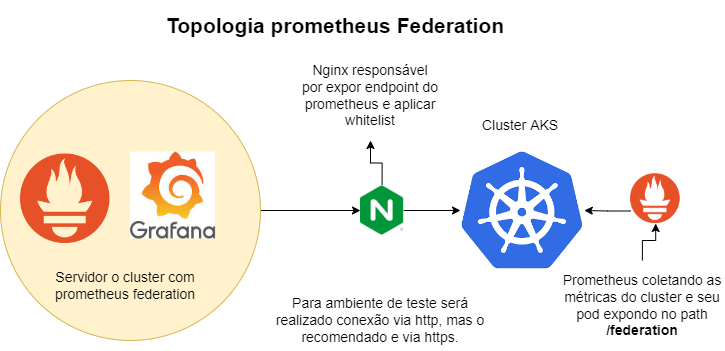

# Prometheus Federation
    O objetivo deste projeto  é compartilhar uma forma de monitorar múltiplos cluster Kubernetes mas de forma centralizada utilizando o prometheus e apresentando os gráfico com grafana. Este projeto utilizei de vários recursos, como infra estrutura como código IAC com terraform, cloud provider azure cuidando da parte de IaaS, acesso a azure com *service principal*, configuração de ingress controller nginx com loadbalancer interno, instalar recurso no cluster kubernetes utilizando helm e estabelecer conexão entre VM e cluster internamente garantindo a seguranças das métricas.


## Requisitos para este projeto e suas versões
* docker
* docker-compose
* prometheus
* grafana
* nginx **será usado como ingress controller e segurança**
* Terraform
    * modulo azurerm *=3.13.0*
    * modulo terraform *>=1.2.4*
    * modulo kubernete *=2.12.0*
* Cluster K8s
* azure 
## Divisão do projeto
- [Ambiente-k8s](./ambiente-k8s/)
    - Arquivo de configuração do cluster
- [Prometeus Federation](./prometheus-federation/)
    - Configuração do prometheus centralizador.
## Link de documentação
* [Documentação Prometheus](https://prometheus.io/docs/introduction/overview/)
* [Documentação prometheus federation] (https://prometheus.io/docs/prometheus/latest/federation/)
* [Documentação nginx] (https://kubernetes.github.io/ingress-nginx/user-guide/nginx-configuration/annotations/)
* [Criar Service Principal](https://docs.microsoft.com/en-us/azure/active-directory/develop/app-objects-and-service-principals)

## Definições
* O que o prometheus?
É um kit de ferramenta de monitoramento e alerta de sistema de código  aberto originalmente construído no Soundcloud.

* O que é o recurso federate do prometheus?
É capacidade de um servidor prometheus extrair séries temporais selecionados de outro servidor prometheus.

## Topologia



## Funcionamento do projeto

Para replicar este projeto é necessário utilizar terraform para provisionar o cluster AKS e a máquina virtual, utilizando de uma service principal. O projeto irá automáticamente criar o cluster e também criar uma VM linux  responsável por receber o prometheus federation.

## Configurando e entendendo Docker-compose

- [docker-compose grafana/prometheus](./prometheus-federation/docker-compose.yaml)
    - GF_SECURITY_ADMIN_PASSWORD=*s7DuVFDsINTex* 
        - definir senha de acesso do grafana 
    - GF_SECURITY_ADMIN_USER=*admin*
        - Definir usuário padrão
    - GF_SERVER_ROOT_URL=http://grafana.teste.com.br:3000/
        - Definir url de acesso do alertas
    - '--storage.tsdb.retention.time=10d'
        - Definir período de retenção do prometheus server
    - '--web.enable-lifecycle'
        - Definir que após 10 o prometheus irá começar a realizar a deleção das métricas mais antigas.
- [Prometheus config](./prometheus-federation/prometheus.yaml)
    - Job de conexão com prometheus federation
```
  - job_name: 'federate'
    honor_labels: true
    metrics_path: '/federate'
    params:
      'match[]':
        - '{job="prometheus"}'
        - '{job="kubernetes-apiservers"}'
        - '{job="kubernetes-nodes-cadvisor"}'
        - '{job="kubernetes-service-endpoints"}'
        - '{job="kubernetes-service-endpoints-slow"}'
        - '{job="prometheus-pushgateway"}'
        - '{job="kubernetes-services"}'
        - '{job="kubernetes-pods"}'
        - '{job="kubernetes-pods-slow"}'
        - '{job="kubernetes-nodes"}'
        - '{__name__=~"job:.*"}'
    static_configs:
      - targets:
        - 'prometheus-dev.test.com.br'
        labels:
          cluster: k8s-DEV 
```
- static_configs => Definir o alvo que será coletado as métricas.
- match => Definir quais métricas estão expostas no prometheus alvo.

- [Prometheus Datasource](./prometheus-federation/prometheus_ds.yaml)
    - Arquivo responsável por criar a conexão do grafana com o prometheus, de forma automática.

## Preparando ambiente terraform
- [Arquivo principal terraform](./ambiente-k8s/main.tf)
O projeto está dividido em módulo e sub-modulos onde temos a organização em forma de árvore, no primeiro arquivos definimos os módulos necessários e seu submodulos desta forma concentramos todos os módulos em um único local.
    - [Credenciais Service principal](./ambiente-k8s/terraform.tfvars)
    É importante definir as credenciais corretas, assim o projeto irá conseguir conectar no azure e realizar a criação dos recursos.
```
subId           = "ID da subscription"
tenId           = "tenant ID"
appId           = "ID da service principal"
password        = "senha-de-acesso"
```    

- [Configurar recursos azurerm](./ambiente-k8s/tfmodules/w2-azurerm/main.tf)
    Arquivo de configuração e definições do recurso do azure.
   - Alterar usuário e senha
        - *admin_username      = "adminuser"*
        -  *admin_password      = "devo-trocar"*

- [Configurar recurso com helm](./ambiente-k8s/tfmodules/helm/main.tf)
    - controller.service.externalTrafficPolicy
    ```
      set {
    name  = "controller.service.externalTrafficPolicy"
    value = "Local"
    }
    ```
     Definir que o ingress controller não irá realizar nat do ip de entrada desta forma é possível criar whitelist com ips liberado caso seja necessário deixar o prometheus de forma pública.

    - controller.service.annotations
    ```
      set{
    name="controller.service.annotations.service\\.beta\\.kubernetes\\.io/azure-load-balancer-internal"
    value="true"
  }
    ```
    Definir que o ingress controller será no padrão loadbalance interno.

- [Configurar prometheus dos cluser](./ambiente-k8s/tfmodules/helm/main.tf)
As configurações da variáveis foram passadas de forma raw com EOT, os parâmetros importantes são:
    - kubeStateMetrics => desabilita o stateMetrics padrão pois é instalado um versão mais atual e com mais recursos.
    - alertmanager => desabilita o alertmanager para utilizar do prometheus federation.
    - nginx.ingress.kubernetes.io/whitelist-source-range => Definir quais ips podem coletar métricas caso o prometheus fica público
    - retention: "2d" => define o tempo de retenção das métricas no dentro do cluster.
    - hosts: ["prometheus-dev.test.com.br"] => Define o endereço FQDN que será utilizado pelo prometheus federation para varrer  as métricas.
```
  values = [
    <<-EOT
        kubeStateMetrics:
            enabled: false
        alertmanager:
            enabled: false
        server:
            retention: "2d"
            ingress:
                enabled: true
                annotations:
                    kubernetes.io/ingress.class: nginx
                    nginx.ingress.kubernetes.io/enable-cors: "true"
                    nginx.ingress.kubernetes.io/cors-allow-origin: "*"
                    # nginx.ingress.kubernetes.io/whitelist-source-range: "192.168.0.1/32" 
                extraLabels: {}
                hosts: ["prometheus-dev.test.com.br"]
                path: /
                pathType: Prefix
                extraPaths: []
    EOT
  ]
}
```